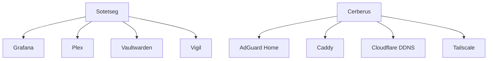

# Homelab

```mermaid
flowchart TB
    sotetseg["Sotetseg"]
    cerberus["Cerberus"]

    sotetseg --> grafana["Grafana"]
    sotetseg --> plex["Plex"]
    sotetseg --> vaultwarden["Vaultwarden"]
    sotetseg --> vigil["Vigil"]

    cerberus --> adguard["AdGuard Home"]
    cerberus --> caddy["Caddy"]
    cerberus --> ddns["Cloudflare DDNS"]
    cerberus --> tailscale["Tailscale"]
```
